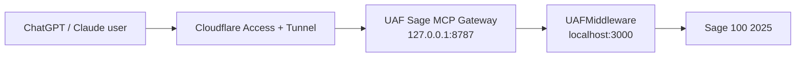

# UAF Sage MCP Gateway

This package exposes the UAF Sage 100 middleware as a remote MCP server over Streamable HTTP.

Recommended production shape:



Do not expose the MCP port or UAFMiddleware directly to the public internet. Keep both bound to localhost and publish only the Cloudflare Access-protected hostname.

## Tool Surface

Enabled by default:

- Health/readiness
- Items, item availability, aliases, alternates, and item validation
- Customers, ship-to validation, and customer resolution
- Sales order search/details
- Vendors
- Purchase orders and purchase order quotes
- Reference data

Hidden unless explicitly enabled:

- `sage_get_customer_account_summary`: finance-sensitive balances/open invoices
- `sage_create_sales_order`: write/non-idempotent sales order creation

## Local Setup

```powershell
cd C:\UAF-Auto\sage-mcp-gateway
npm ci
npm run build
copy .env.example .env
notepad .env
npm start
```

Health checks:

```powershell
curl http://127.0.0.1:8787/healthz
curl http://127.0.0.1:8787/readyz
```

MCP endpoint:

```text
http://127.0.0.1:8787/mcp
```

If `MCP_SHARED_SECRET` is set, direct MCP calls need:

```text
Authorization: Bearer <MCP_SHARED_SECRET>
```

## Environment Variables

| Variable | Default | Notes |
| --- | --- | --- |
| `MCP_HOST` | `127.0.0.1` | Keep localhost for Cloudflare Tunnel deployment. |
| `MCP_PORT` | `8787` | Local gateway port. |
| `MCP_ALLOWED_HOSTS` | `127.0.0.1,localhost` | Host header allow list for DNS rebinding protection. Include the Cloudflare public hostname or set `httpHostHeader: localhost` in `cloudflared`. |
| `MCP_SHARED_SECRET` | unset | Optional direct bearer auth. Use Cloudflare Access publicly. |
| `UAF_SAGE_API_URL` | `http://localhost:3000` | Existing middleware base URL. |
| `UAF_SAGE_READ_API_KEY` | unset | Required read-scoped middleware key. |
| `UAF_SAGE_CREATE_API_KEY` | unset | Required only when create tools are enabled. |
| `UAF_SAGE_FINANCE_API_KEY` | unset | Required only when finance tools are enabled. |
| `ENABLE_CREATE_TOOLS` | `false` | Enables `sage_create_sales_order`. |
| `ENABLE_FINANCE_TOOLS` | `false` | Enables account summary tool. |
| `UAF_SAGE_TIMEOUT_MS` | `30000` | Upstream request timeout. |

The aliases `UAF_BASE_URL`, `UAF_API_KEY_READ`, `UAF_API_KEY_CREATE`, and `UAF_API_KEY_FINANCE` are also supported.

## Windows Service

The installer uses WinSW to wrap Node as a real Windows service. If the server has no internet access, download `WinSW-x64.exe` from the WinSW GitHub releases page first and pass `-WinSWPath`.

Run PowerShell as Administrator:

```powershell
cd C:\UAF-Auto\sage-mcp-gateway
.\install-service.ps1 `
  -ReadApiKey "<read-key>" `
  -AllowedHosts "127.0.0.1,localhost,mcp.company.com" `
  -McpSharedSecret "<long-random-secret>"
```

Finance and create tools stay disabled unless you pass `-EnableFinanceTools` or `-EnableCreateTools` and provide the matching scoped key.

## Cloudflare Access

1. Install `cloudflared` as a Windows service on the Sage server.
2. Create a public hostname such as `mcp.company.com`.
3. Route that hostname to `http://127.0.0.1:8787`.
4. Protect the hostname with Cloudflare Access using your IdP groups.
5. For automation clients, use Cloudflare service tokens or mTLS.

ChatGPT/Claude should connect to:

```text
https://mcp.company.com/mcp
```

For ChatGPT or Claude enterprise use, add a remote MCP connector/custom connector with the Streamable HTTP URL above. Keep write and finance tools off for the first test, then enable them only after the client confirms the approval flow they want for sensitive tools.

## Sensitive Exclusions

Do not commit `.env`, Sage credentials, UAF API keys, Cloudflare tunnel credentials, Cloudflare service tokens, OAuth client secrets, real customer data, customer balances, open invoice data, or logs containing PO/customer/account payloads.
